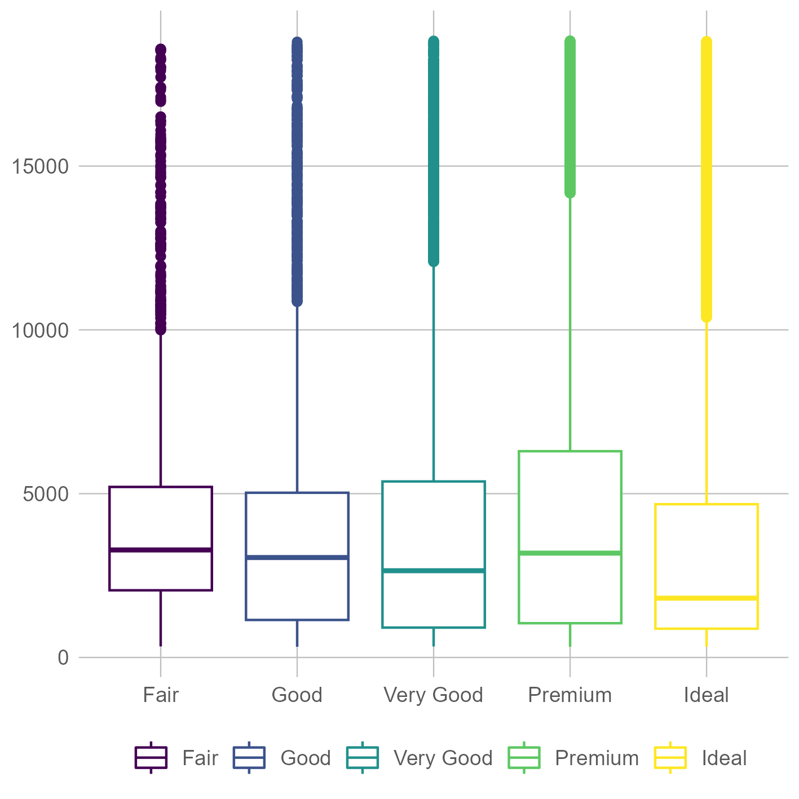
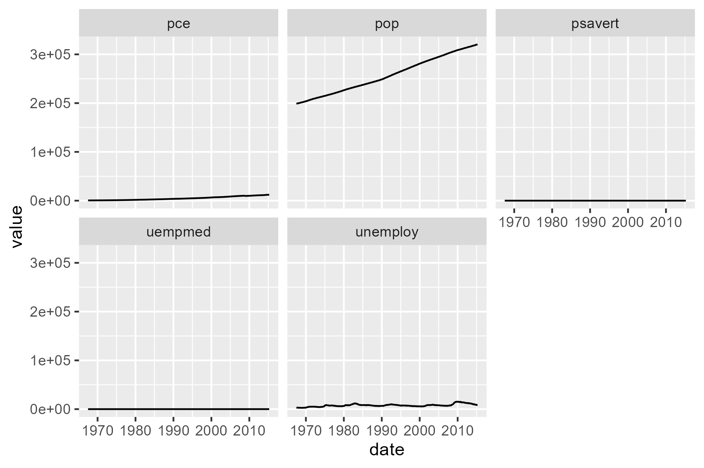

```{r setup, include=FALSE}
knitr::opts_chunk$set(echo = TRUE)
```

# Instructions:

Use "ggplot2" and "ggthemes" to recreate the following **two** plots and then create your own plot in task **three**. Recall that "ggplot2" is part of tidyverse, however "ggthemes" is its own package.

All required data sets are part of ggplot. The ggplot2 cheat sheet is essential for this assignment.

Submit a saved version of your Rscript to moodel. This means that you don't need to export the graphs, or try to save in the correct dimensions.

I suggest exploring each data set before you try to graph it, you can do this with the help function (?) or by searching the internet for the ggplot built-in data sets.

The weights of each tasks can be found in each question, and the whole assessment is worth 25% of your grade.

# Due: 03/04/23

# Tasks
  * Recreate plot 1 (below) to the best of your ability (25%)
  * Recreate plot 2 (below) to the best of your ability (25%)
  * Create your own plot (50%)
    - Read the documentation for the diamonds data set (use '?ggplot2::diamonds'). Amongst the variables in the data set think about which relationships are the most interesting. Make a graph to test these relationships, ideally publication quality. Each missing element from your graph reduces your mark. Put a comment in the script to communicate what you are trying to show before the graph. After the graph talk through what the graph means in relation to your first thoughts.


\newpage
## Plot 1 - Data: ggplot2::diamonds, 

Hint: Set the theme, it is an excel replica



## Plot 2 - Data: ggplot2::economics_long



